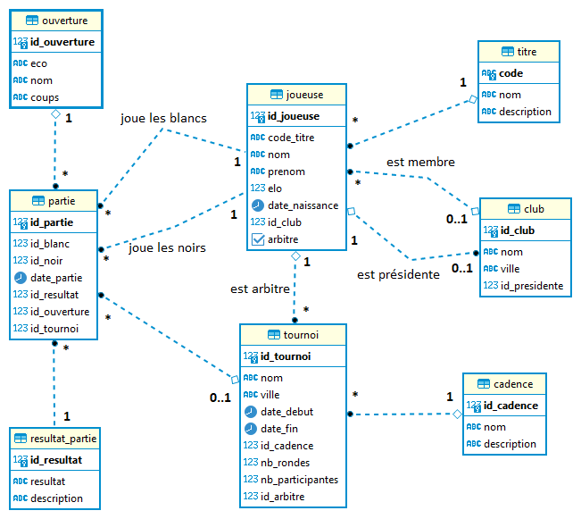

## Instructions {.unnumbered}

- Examen sur papier
- Durée : 2h
- Sans documents
- Sans calculatrice

::: {.callout-important title="À lire avant de commencer"}
- Les exercices peuvent être traités dans l'ordre de votre choix.
- Le sujet vous paraîtra peut-être un peu long. Si vous bloquez sur une question, passez rapidement à la suivante.
- Dans chaque exercice, les questions ne sont pas forcément de difficulté croissante.
- Sauf mention contraire, les différentes questions attendent des [réponses courtes]{.underline}.
- Respectez scrupuleusement les consignes. Cependant, si une question ne vous semble pas claire, notez sur votre copie la manière dont vous l'avez comprise et traitée.
- Veuillez respecter les règles de base du langage et les bonnes pratiques (casse, mots-clés, ordre et indentation). Vous serez pénalisés si vos requêtes SQL ne respectent pas le formalisme donné en cours et en TP.
- Vous répondrez au **QCM** sur votre copie d'examen en recopiant simplement le numéro de la question ainsi que les réponses choisies. Aucune justification n'est attendue.
:::



## Questions de cours (3 points)

::: {.callout-note title="Instructions"}
Répondez brièvement aux questions suivantes.
:::

a. Citez 3 différents formats de fichiers pour stocker de la donnée.
b. Qu'utiliseriez-vous pour stocker des données représentant un volume de :
  - 100 Ko
  - 1 Go
  - 100 Go

  Justifiez vos choix.

c. Qu'est-ce qu'une table ?
d. À quoi sert un schéma ?
e. Citez 5 opérateurs de l'algèbre relationnelle.
f. Dans la requête suivante, que signifie `WITH GRANT OPTION` ?

\

```sql
GRANT ALL PRIVILEGES
ON echecs.joueuse
TO chantal
WITH GRANT OPTION;
```



## QCM (7 points)

::: {.callout-note title="Instructions"}

Chaque question peut avoir une ou plusieurs réponses correctes (au minimum une réponse est correcte).

Réponse correcte : **1 point**.  
Réponse partiellement correcte : **ratio**.  
Si présence d'une réponse fausse : **0**.

:::

### Dans une base de données relationnelle, une clé primaire :

a. Contient uniquement des valeurs non nulles.
b. Identifie de manière unique chaque ligne d'une table.
c. Peut être constituée de plusieurs colonnes.
d. Est toujours générée automatiquement.

### Dans une base de données relationnelle, une clé étrangère :

a. Contient des valeurs uniques.
b. Contient uniquement des valeurs non nulles.
c. Référence la clé primaire d'une autre table.
d. Est obligatoire pour faire le lien avec une autre table.

### Dans une commande `SELECT`, la clause `WHERE` :

a. Permet de trier les données.
b. Sert à filtrer les lignes en fonction d'une condition.
c. Permet d'agréger les données.
d. Peut être utilisée pour filtrer après un `GROUP BY`.

### Vous disposez de deux tables `client` et `commande` liées par le champ `id_client`. Votre objectif est de lister **tous** les clients ainsi que leur nombre de commandes.

Quel type de jointure pouvez-vous utiliser ?

a. FULL OUTER JOIN
b. INNER JOIN
c. NATURAL JOIN
d. LEFT JOIN
e. CROSS JOIN



### Une transaction SQL permet :

a. D'assurer que toutes les opérations d'une transaction soient exécutées correctement ou qu'aucune ne soit effectuée en cas d'erreur.
b. D'améliorer les performances des requêtes.
c. De verrouiller temporairement les données pour éviter les conflits avec d'autres opérations concurrentes.
d. De limiter le nombre d'opérations pouvant être effectuées dans une base de données.
e. De garantir la cohérence des données même en cas de panne du système.

### Cette table respecte-t-elle les formes normales ?

| id_etudiant | nom_etudiant | id_cours | nom_cours     | professeur |
|-------------|--------------|---------:|---------------|------------|
| 1           | Anaïs        | 101      | Mathématiques | Dupont     |
| 2           | Benoît       | 102      | Informatique  | Martin     |
| 3           | Claire       | 101      | Mathématiques | Dupont     |
| 1           | Anaïs        | 103      | Physique      | Lefevre    |

a. Elle ne respecte aucune des formes normales.
b. Elle respecte la première forme normale (1NF).
c. Elle respecte la deuxième forme normale (2NF).
d. Elle respecte la troisième forme normale (3NF).

### Quelles propositions sont correctes à propos des vues ?

a. Une vue permet de simplifier l'accès aux données.
b. Une vue stocke physiquement les résultats de la requête SQL dans la base de données.
c. Une vue peut être utilisée pour restreindre l'accès à certaines lignes ou colonnes d'une table.
d. Les performances peuvent être affectées par l'utilisation de vues.



## Requêtes SQL (5 points)

{width=80%}

En vous appuyant sur le modèle de base de données du schéma `echecs` ci-dessus, écrivez les requêtes permettant de répondre aux questions suivantes.

a. Listez les noms, prénoms et elo de toutes les joueuses, classées par elo décroissant.
b. Listez les noms, prénoms, elo et nom du club des joueuses ayant un elo supérieur à 2000 et dont le prénom se termine par la lettre `A`.
c. Affichez, pour tous les tournois, le nom du tournoi, le nom de la cadence, les nom et prénom de l'arbitre ainsi que le nom de son éventuel club.
d. Listez les joueuses qui auraient joué des parties contre elles-mêmes.
e. Comptez le nombre de parties jouées par nom d'ouverture.
f. Listez les clubs dont la moyenne elo de leurs joueuses est comprise entre 1500 et 1700. Pour chaque club, affichez :

- le nom du club
- la moyenne elo
- le elo maximum
- le nombre de joueuses

Ordonnez les résultats par moyenne elo.



## Modélisation (5 points)

Vous devez concevoir une base de données pour gérer les informations sur des personnes qui participent à des compétitions sportives. Toutes ces personnes adhèrent obligatoirement à un et un seul club.

Une compétition est définie par :

- son nom
- sa date
- sa ville
- son type

Il existe trois types de compétitions sportives :

- Natation
- Cyclisme
- Course à pied

Chaque compétition est associée à un seul de ces types.

Un club est défini par :

- son nom
- sa ville
- sa date de création

Une personne est adhérente à un seul club.

### Conception de la base de données

Définissez les tables nécessaires, leurs relations, les clés et les cardinalités pour représenter ce système en respectant les trois premières formes normales.

Vous pouvez modéliser :

- soit sous la forme d'un schéma UML
- soit en utilisant la notation relationnelle (`table(colonne1, colonne2, ...)`)

Expliquez et commentez vos choix de conception.

### Requête SQL 1

Écrivez une requête SQL pour lister toutes les personnes ayant participé à une épreuve de Natation.

Affichez :

- le nom
- le prénom
- le nom de l'épreuve

### Requête SQL 2

Écrivez une requête SQL qui affiche, pour chaque club et chaque type de compétition, le nombre de membres ayant participé.
