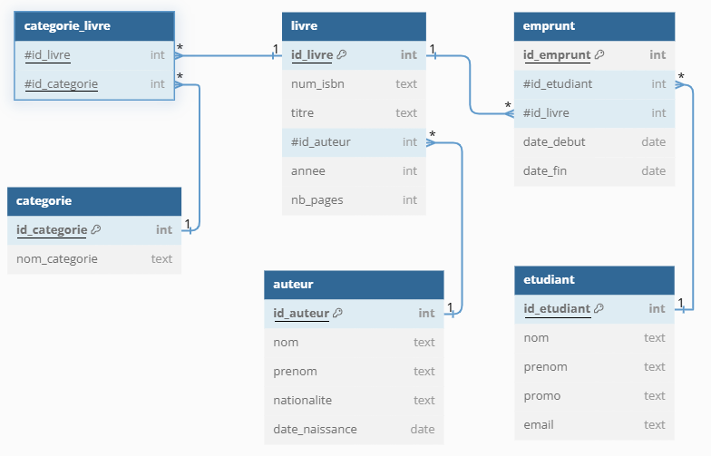

## Instructions {.unnumbered}

- Examen sur papier
- Durée : 2h
- Sans documents
- Sans calculatrice

::: {.callout-important title="À lire avant de commencer"}

- Les exercices peuvent être traités dans l'ordre de votre choix.
- Le sujet vous paraîtra peut-être un peu long. Si vous bloquez sur une question, passez rapidement à la suivante.
- Dans chaque exercice, les questions ne sont pas forcément de difficulté croissante.
- Sauf mention contraire, les différentes questions attendent des [réponses courtes]{.underline}.
- Respectez scrupuleusement les consignes. Cependant, si une question ne vous semble pas claire, notez sur votre copie la manière dont vous l'avez comprise et traitée.
- Veuillez respecter les règles de base du langage et les bonnes pratiques (casse, mots-clés, ordre et indentation). Vous serez pénalisés si vos requêtes SQL ne respectent pas le formalisme donné en cours et en TP.
- Vous répondrez au **QCM** sur votre copie d'examen en recopiant simplement le numéro de la question ainsi que les réponses choisies. Aucune justification n'est attendue.

:::



## Questions à réponses courtes (2 points)

::: {.callout-note title="Instructions"}
Répondez brièvement aux questions suivantes.
:::

a. Citez au moins cinq outils ou logiciels utilisés en TP.
b. Vous disposez d'une table `personne(id_personne, nom, prenom, age)`. Vous devez stocker la liste des compétences de chaque personne. Comment faites-vous ?
c. Qu'est-ce qu'un snapshot ?
d. À quoi sert un schéma ?
e. Citez 6 opérateurs de l'algèbre relationnelle.



## QCM (8 points)

::: {.callout-note title="Instructions"}
Chaque question peut avoir une ou plusieurs réponses correctes (au minimum une réponse est correcte).

Réponse correcte : **1 point**.  
Réponse partiellement correcte : **ratio**.  
Si présence d'une réponse fausse : **0**.
:::

### Dans une base de données relationnelle, une clé primaire :

a. Peut être constituée de plusieurs colonnes.
b. Doit toujours être un nombre entier.
c. Est automatiquement indexée par le SGBD.
d. Contient uniquement des valeurs non nulles.
e. Identifie de manière unique chaque ligne d'une table.

### À propos des clés étrangères, quelles affirmations sont correctes ?

a. Son utilisation est obligatoire pour représenter une relation entre deux tables.
b. Elle peut référencer la clé primaire de sa propre table.
c. Elle empêche l'insertion d'une ligne si la valeur référencée n'existe pas dans la table cible.
d. Dans une association 1-n, elle peut être positionnée au choix dans l'une des deux tables.

### Pour lister les joueuses dont le Elo est supérieur à la moyenne, je peux utiliser :

a. La condition `WHERE elo > AVG(elo)`.
b. Une sous-requête dans la clause `WHERE` pour comparer le Elo d'une joueuse à la moyenne.
c. Une CTE pour calculer la moyenne Elo, puis filtrer les joueuses en comparant leur Elo à la valeur calculée.
d. Une clause `GROUP BY` pour calculer la moyenne Elo, puis sélectionner uniquement les joueuses dont le Elo est supérieur à cette moyenne.

### Un index :

a. Permet d'accélérer les recherches sur une ou plusieurs colonnes d'une table.
b. Améliore les performances de toutes les opérations sur une table.
c. Prend de la place sur le disque.
d. Est particulièrement efficace pour les tables très petites.
e. Garantit l'unicité des valeurs d'une colonne.

### Quelles propositions sont correctes à propos des vues ?

a. Une vue stocke physiquement les résultats de la requête SQL dans la base de données.
b. Supprimer une vue supprime également les données de la table sous-jacente.
c. Les performances peuvent être affectées par l'utilisation de vues.
d. Une vue peut être utilisée pour restreindre l'accès à certaines lignes ou colonnes d'une table.

### Quelles syntaxes permettent correctement de concaténer `nom` et `prenom` dans une requête PostgreSQL ?

a. `SELECT nom + ' ' + prenom FROM echecs.joueuse;`
b. `SELECT nom || ' ' || prenom FROM echecs.joueuse;`
c. `SELECT CONCAT(nom, ' ', prenom) FROM echecs.joueuse;`
d. `SELECT CONCAT_WS(' ', nom, prenom) FROM echecs.joueuse;`
e. `SELECT nom && prenom FROM echecs.joueuse;`

### À propos de la commande SQL `DELETE FROM echecs.joueuse;` :

a. La requête supprime toutes les lignes de la table `echecs.joueuse`.
b. La requête supprime la table `echecs.joueuse`.
c. La requête peut être annulée par un `ROLLBACK` si elle est exécutée dans une transaction non validée.
d. Les contraintes de clé étrangère peuvent empêcher l'exécution de cette requête.
e. Après cette requête, la structure de la table reste intacte.
f. La commande déclenche les triggers de suppression définis sur la table, s'il y en a.

### À propos du format de fichier Parquet, quelles affirmations sont correctes ?

a. Parquet est un format de stockage en colonnes, optimisé pour les requêtes analytiques.
b. Parquet stocke les données ligne par ligne, ce qui permet des insertions rapides.
c. Parquet utilise des techniques de compression et d'encodage pour réduire la taille des fichiers.
d. Les fichiers Parquet sont lisibles directement par un humain, comme un fichier CSV.
e. Parquet peut stocker des statistiques sur les colonnes, comme des minimums et maximums, pour optimiser les lectures.

\

```{.sql}
SELECT c.nom      AS nom_club,
       COUNT(1)   AS nb_joueuses,
       AVG(j.elo) AS moyenne_elo
  FROM echecs.joueuse j
  JOIN echecs.club c USING(id_club)
 WHERE j.elo > 2000
 GROUP BY c.nom
HAVING AVG(j.elo) > 2200;
```

### Quelles propositions sont correctes à propos de la requête ci-dessus ?

a. La clause `WHERE` filtre les joueuses ayant un Elo strictement supérieur à 2000 avant l'agrégation.
b. La clause `HAVING` filtre les clubs dont la moyenne des Elo est strictement supérieure à 2200.
c. Le nombre de joueuses compte uniquement les joueuses avec Elo > 2000.
d. La moyenne Elo est calculée sur toutes les joueuses du club, même celles avec Elo ≤ 2000.
e. Si un club n'a aucune joueuse avec Elo > 2000, il ne sera pas présent dans le résultat.



## Requêtes SQL (7 points)

{width=80%}

### Questions préliminaires

i. Quel est l'intérêt de la table `categorie_livre` ?

ii. Est-ce qu'un livre peut avoir plusieurs auteurs ?

iii. Comment feriez-vous pour vous assurer que le nombre de pages soit un entier positif ?

### Requêtes

Écrivez les requêtes permettant de répondre aux questions suivantes.

a. Listez les noms, prénoms et dates de naissance des auteurs, classés par nom puis par prénom.
b. Listez les titres des livres de 2012 de 500 pages ou plus, ainsi que les nom et prénom de leur auteur.
c. Quels sont les titres des livres qui n'ont jamais été empruntés ?
d. Pour les emprunts en cours, affichez le titre du livre, le nom de l'auteur et le nom de l'étudiant qui l'a emprunté.
e. Quel est le nombre de livres par nom de catégorie ?
f. Donnez la liste des étudiants de 1A qui ont emprunté 15 livres ou plus.
g. Supprimez les étudiants dont le mail est invalide (c'est-à-dire ne respectant pas le motif `xx@yy.zz` avec `xx`, `yy` et `zz` non vides). Que se passe-t-il si ces étudiants ont déjà emprunté des livres ?



## Modélisation (3 points)

Une entreprise souhaite mettre en place un système de gestion des congés de ses employés. L'objectif est de permettre :

- aux employés d'enregistrer leurs demandes de congés ;
- aux responsables hiérarchiques directs de valider ou refuser ces demandes ;
- aux responsables hiérarchiques de déléguer temporairement la validation à un autre employé en cas d'absence.

Les congés peuvent être de différents types (congés annuels, RTT, récupération, garde d'enfant malade, etc.).

Chaque demande de congé possède :

- un type
- une date de début
- une date de fin
- un statut (validé, refusé, en attente)
- un motif de rejet le cas échéant

Le système doit permettre d'identifier la personne ayant validé (ou refusé) chaque demande.

Chaque employé (nom, prénom) a un supérieur hiérarchique direct chargé de valider ses demandes de congés. Seule la personne dirigeant l'entreprise n'a pas de supérieur.

Un responsable peut déléguer temporairement la validation des congés de son équipe à un autre employé, par exemple en cas d'absence.

> Il n'est pas demandé de vérifier si l'employé dispose d'un solde de congés suffisant.

### Conception de la base de données

Définissez les tables et les colonnes nécessaires, leurs relations, les clés et les cardinalités pour représenter ce système en respectant les trois premières formes normales.

Vous pouvez modéliser :

- soit sous la forme d'un schéma UML ;
- soit en utilisant la notation relationnelle (`table(colonne1, colonne2, ...)`).

Expliquez et commentez vos choix de conception.
