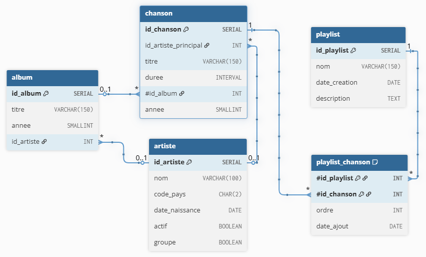

## Introduction {.unnumbered}

::: {.callout-important}
- Écrivez des requêtes jolies !
- À la fin du TP, exportez ou copiez vos requêtes dans un fichier de votre VM ou machine personnelle
:::

Les notions vues dans ce TP :

- agrégations
- jointures
- insertion de données
- utilisation de séquence
- bonus : CTE (vu au dernier cours)


## Lancement des services

Pour plus de détails, allez dans l'onglet [Datalab](../outils/datalab.qmd){target="_blank"}.

- [ ] Connectez-vous à un Datalab
- [ ] Lancez un service **PostgreSQL**
- [ ] Lancez un service **cloudBeaver**
  - ouvrez ce service
  - vérifiez que vous êtes connectés à la base de données PostgreSQL


## Les données

Le thème du jour sera la musique :musical_note: :guitar: :trumpet:

### Chargez les données

- [ ] Copiez le contenu de ces 2 scripts sql 
  - [création des tables](./data/tp3-create-tables.sql){target="_blank"} 
  - [insertion des données](./data/tp3-pop-tables.sql){target="_blank"} 
- [ ] Collez-les dans la fenêtre SQL de CloudBeaver
- [ ] Exécutez les scripts
  - Cliquez sur la petite icone sous les triangles oranges qui ressemble à :scroll:
  - raccourci (ALT + X)


### Description

Les tables sont les suivantes :

- **artiste**([id_artiste]{.underline}, nom, code_pays, date_naissance, actif)
- **album**([id_album]{.underline}, titre, annee, #id_artiste)
- **chanson**([id_chanson]{.underline}, #id_artiste_principal, titre, duree, #id_album, annee)
- **playlist**([id_playlist]{.underline}, nom, date_creation, description)
- **playlist_chanson**([#id_playlist, #id_chanson]{.underline}, ordre, date_ajout)


### Modèle de données





## Exercice

### Exploration des tables

Lorsque vous prenez en main une base de données, la première chose à faire est de regarder ce que contiennent les tables.

- [ ] Listez toutes les chansons
- [ ] Affichez les colonnes *titre* et *année* ainsi que le *nom de l'artiste principal*
- [ ] Ordonnez par nom d'artiste, puis par titre
- [ ] Ajoutez le titre de l'album [si celui-ci est précisé]{.underline}
- [ ] Ajoutez le nom de l'artiste de l'album
- [ ] Est-ce qu'il y a des chansons où il y a une différence entre :
  - l'artiste principal de la chanson
  - l'artiste de l'album qui contient cette chanson

Faisons quelques statistiques descriptives.

- [ ] Quelle sont les durées minimum, maximum et moyenne des chansons
- [ ] Affichez le nombre de chansons par année
  - ordonnez par nombre de chansons décroissant
- [ ] Quelles sont les années avec au moins 10 chansons
- [ ] Complétez la dernière requête en ajoutant la durée moyenne des chansons pour chaque année

Est-ce qu'il y a plusieurs chansons ayant le même titre ?

- [ ] Pour chaque titre de chanson, comptez le nombre d'occurences
- [ ] Est-ce qu'il y a des titres de chansons présents au moins deux fois ?
- [ ] Est-ce qu'il y a des chansons en doublon ?
  - i.e. même titre et même artiste

Si vous en trouvez une, essayez de la supprimer. À votre avis, pourquoi cela ne fonctionne pas ?

- [ ] Créez une vue *titre_frequent* listant les titres des chansons présents au moins deux fois ?
- [ ] Pour ces titres, affichez tous les détails des chansons, ainsi que l'artiste principal
  - triez par titre


### Place aux artistes

- [ ] Listez les noms d'artistes ainsi que les titres de leurs chansons
- [ ] Comptez le nombre de chansons par artiste
- [ ] Classez par ordre décroissant
- [ ] Conservez uniquement les artistes ayant 20 chansons ou plus

Il y a des artistes solo et des groupes. Pour les groupe la date de naissance ne devrait pas être renseignée.

- [ ] Mettez à jour la table pour supprimer les dates de naissance des groupes
  - :scream: si vous avez fait une bétise, pas de panique, il faut relancer les deux scripts du début de TP (create and pop)
- [ ] Quel est le plus viel artiste solo en activité ?

Interessons nous maintenant aux pays des artistes.

- [ ] Comptez le nombre d'artistes par pays

### Créez votre playlist

- [ ] Insérez une nouvelle ligne dans la table *playlist*
- [ ] Ajoutez 5 chansons dans votre playlist

::: {.callout-tip}
Aucune de ces chansons ne correspond à vos goût musicaux...

Vous êtes vraiment sûr ?

Allez un petit effort, il y a des chansons et des artistes très sympas.
:::

Nous allons maintenant ajouter à votre playlist toutes les chansons de l'album *Californian Soil*.

Pour créer votre requête d'insertion, vous allez avoir besoin des données suivantes : 

- *id_playlist* : vous pouvez soit :
  - insérer la valeur "en dur"
  - utiliser `CURRVAL('playlist_id_playlist_seq')` pour obtenir la dernière valeur de *id_playlist* i.e. celui de la playlist que vous venez de créer
- *id_chanson* : il va falloir une reqûete pour les récupérer
- *ordre* : vous allez créer et utiliser une séquence
- *date_ajout* : vous utiliserez simplement : `CURRENT_DATE`

---

- [ ] Créez une séquence nommée *seq_playlist_ordre*
  - comme vous avez déjà inséré 5 chansons, les valeurs de la colonne ordre de 1 à 5 sont normalement déjà prises
  - commencez votre séquence à la valeur 6
- [ ] Listez toutes les chansons de l'album *Californian Soil*
- [ ] Insérer dans votre playlist toutes les chansons de l'album *Californian Soil*

::: {.callout-tip title="Un peu d'aide" collapse="true"}
Pour trouver un peu d'inspiration, un exemple d'INSERT en utilisant un SELECT :

```{.sql}
INSERT INTO joueuse_copy(nom, prenom, numero, date_creation)
SELECT nom,
       'pierre',
       nextval('seq_numero'),
       CURRENT_DATE
  FROM joueuse;
```
:::


Est-ce que vous pouvez ajouter plusieurs fois la même chanson dans une playlist ? Pourquoi ?

Comment pourrait-t-on faire pour s'affranchir de cette contrainte ?


### Votez pour la meilleure playlist

Interessons-nous maintenant aux playlists.

- [ ] Affichez les playlists
- [ ] Ajoutez les titres des chansons de la playlist
  - Colonnes à afficher : nom de la playlist, ordre, titre de la chanson
  - Classez par noms de playlists, puis ordre
- [ ] Ajoutez les noms des artistes

Vous remarquez qu'à l'affichage vous avez deux colonnes appelées "nom". Pour faire la différence, vous allez modifier l'affichage de ces colonnes.

- [ ] Modifiez le *SELECT* pour afficher les entêtes de colonnes *Nom de la playlist*, *Titre de la chanson* et *Nom de l'artiste*

---

- [ ] Quelle playlist a le plus de chansons ?
- [ ] Quelle playlist dure le plus longtemps ?

Nous allons maintenant rechercher les artistes mal-aimés i.e. ceux qui ne sont dans aucune playlist. 

Procédons par étape:

- [ ] Listez les artistes présents dans les playlists
- [ ] Ensuite, gardez uniquement les *id_artiste* sans doublons
- [ ] Affichez les artistes qui ne sont présents dans aucune playlist
  - en utilisant `NOT IN` et une sous-requête
  - conservez uniquement les *id_artiste* qui ne sont pas dans la requête précédente
- [ ] Même question avec `NOT EXISTS`
  - la syntaxe est un peu moins intuitive mais la requête est plus optimisée

Concentrons-nous maintenant sur les artistes et les chansons les plus populaires.

Vous avez écrit précédemment une requête listant les playlists avec les artistes et les chansons. Repartez de cette requête.

- [ ] Comptez combien de fois chaque chanson apparait dans une playlist
  - affichez le titre de la chanson, le nom de l'artiste, et le nombre de playlists
  - ordonnez par nombre de playlists décroissant
- [ ] Au lieu de faire un simple **JOIN** avec la table *playlist_chanson*, faites un **LEFT JOIN**
  - Est-ce que « Tu feras la différence. Ton coeur prend des vacances. Il danse avec les loups. » ?
- [ ] Conservez uniquement celles qui apparaissent dans au moins 3 playlists
- [ ] Combien y-a-t-il de chansons dans toutes les playlists
- [ ] Combien y-a-t-il de chansons différentes dans toutes les playlists


### I'm WITH u

Les CTE seront évoquées au dernier cours. Cela parait compliqué à première vue mais le principe est très simple.

::: {.callout-note title="CTE"}
Une CTE (Common Table Expression) est une table temporaire nommée définie au début d’une requête avec le mot-clé **WITH**.

À quoi ça sert ?

- Rendre une requête plus lisible (au lieu d’imbriquer des sous-requêtes)
- Réutiliser un même sous-résultat plusieurs fois
- Servir de base à des requêtes récursives
:::

Que fait cette requête ?

```{.sql}
SELECT DISTINCT ON (code_pays) code_pays, 
       nom, 
       date_naissance
  FROM music.artiste
 WHERE NOT groupe
 ORDER BY code_pays, 
          date_naissance ASC;
```

Nous allons ici construire pas à pas une requête donnant le même résultat en utilisant une CTE.

- [ ] Listez les artistes qui ne sont pas des groupes
- [ ] Affichez pour chaque pays, la plus ancienne date de naissance (celle du plus vieil artiste)

Nous souhaitons maintenant récupérer le nom du plus viel artiste de chaque pays.

L'idée pour obtenir ce nom :

- stocker le résultat de notre dernière requête dans une table temporaire *viel_artiste_pays*
- joindre cette table à la table *artiste* via les colonnes *pays* et *date_naissance*

```{.sql}
WITH viel_artiste_pays AS (
...
)
SELECT ...
  FROM ...
  JOIN viel_artiste_pays pv ON ...
  ...
```

- [ ] En complétant la requête à trous ci-dessus, donnez pour chaque pays l'artiste le plus vieux

::: {.callout-tip title="Autre exemple"}
Pour vous aider, voici un autre exemple.

Si l'on veut les noms des artistes qui sont les seuls à représenter leur pays :

- nous commençons par lister les pays avec un seul artiste
- nous joignons avec la table *artiste* pour récupérer dans un second temps les noms

```{.sql}
WITH artiste_seul_dans_pays AS (
SELECT code_pays,
       COUNT(*) AS nb_artistes
  FROM artiste
 GROUP BY code_pays
HAVING COUNT(*) = 1
)
SELECT a.*
  FROM artiste a
  JOIN artiste_seul_dans_pays n ON a.code_pays = n.code_pays;
```
:::

::: {.callout-tip collapse="true" title="Solutions"}
- [Correction TP3](./correction/tp3.sql)
:::

## Arrêtez vos services {.unnumbered}

C'est la fin du TP, vous pouvez maintenant sauvegarder votre travail et libérer les ressources réservées :

- [ ] Copiez-collez vos scripts SQL sur votre machine
- [ ] Arrêter les services du Datalab
